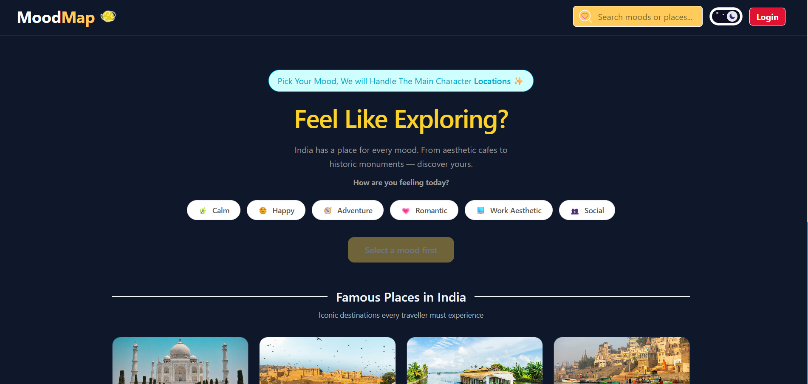

#  MoodMap

> **Travel by mood, not by plans.**

MoodMap is a mood-based travel discovery app for India. Pick how you're feeling — calm, adventurous, romantic, social — and discover destinations that match your vibe. Built with Next.js, MongoDB, and NextAuth.


---

## 🌐 Live Demo

🔗 **[mood-map-beige.vercel.app](https://mood-map-beige.vercel.app)**

---

## ✨ Features

- 🎭 **Mood-based filtering** — Select your mood and discover matching destinations across India
- 🔐 **Authentication** — Email/password signup + Google OAuth via NextAuth.js
- 🔒 **Protected routes** — Mood filtering unlocked only for logged-in users
- 🔍 **Search** — Search places by name, city, or state via URL params
- 📖 **Detail pages** — Click any place to see a full detail page powered by the **Wikipedia API** (free, no key needed)
- 📱 **Responsive navbar** — Mobile-friendly with collapsible search bar
- 🌙 **Theme toggler** — Light/dark mode with localStorage persistence
- 🔔 **Toast notifications** — Login, logout, and error feedback via react-hot-toast
- 🗂️ **25+ destinations** — Covering all moods across India

---

## 🛠️ Tech Stack

| Category | Technology |
|---|---|
| Framework | Next.js 15 (App Router) |
| Styling | Tailwind CSS v4 |
| Authentication | NextAuth.js v4 |
| Database | MongoDB Atlas + Mongoose |
| External API | Wikipedia REST API |
| Notifications | react-hot-toast |
| Deployment | Vercel |

---

## 📸 Screenshots


---

## 🚀 Installation & Setup

### 1. Clone the repo
```bash
git clone https://github.com/anuradhasharma1/mood-map.git
cd mood-map
```

### 2. Install dependencies
```bash
npm install
```

### 3. Set up environment variables
Create a `.env.local` file in the root:
```env
MONGODB_URI=your_mongodb_connection_string
NEXTAUTH_SECRET=your_nextauth_secret
NEXTAUTH_URL=http://localhost:3000
GOOGLE_CLIENT_ID=your_google_client_id
GOOGLE_CLIENT_SECRET=your_google_client_secret
```

### 4. Run the development server
```bash
npm run dev
```

Open [http://localhost:3000](http://localhost:3000) in your browser.

---

## 📁 Project Structure

```
mood-map/
├── app/
│   ├── api/
│   │   └── auth/
│   │       ├── [...nextauth]/route.js   # NextAuth config
│   │       └── register/route.js        # User registration
│   ├── login/page.js                    # Login & Register page
│   ├── places/[id]/page.js             # Dynamic place detail page
│   ├── layout.js                        # Root layout
│   └── page.js                          # Homepage
├── components/
│   ├── AuthProvider.js                  # Session provider wrapper
│   ├── HeroSection.js                   # Hero with mood-reactive colors
│   ├── MoodSelector.js                  # Mood pill buttons
│   ├── Navbar.js                        # Responsive navbar
│   ├── PlaceCard.js                     # Place card component
│   └── PlaceGrid.js                     # Places grid with filtering
├── data/
│   ├── moods.js                         # Mood definitions + colors
│   └── places.js                        # 25 Indian destinations
└── lib/
    └── mongodb.js                       # MongoDB connection
```

---

## 🔮 Future Plans

- [ ] Google Maps integration with Leaflet.js for location pins
- [ ] Save favourite places (wishlist feature)
- [ ] User profile page
- [ ] More Indian destinations 
- [ ] TypeScript migration
- [ ] Weather integration for each destination

---

## 👩‍💻 Author

**Anuradha Sharma**
- GitHub: [@anuradhasharma1](https://github.com/anuradhasharma1)

## 👨‍💻 Connect with me
[LinkedIn](https://www.linkedin.com/in/anuradha-sharmaa1/)

---

## 📄 License

This project is open source and available under the [MIT License](LICENSE).

---

> Built with ❤️ for India 🇮🇳