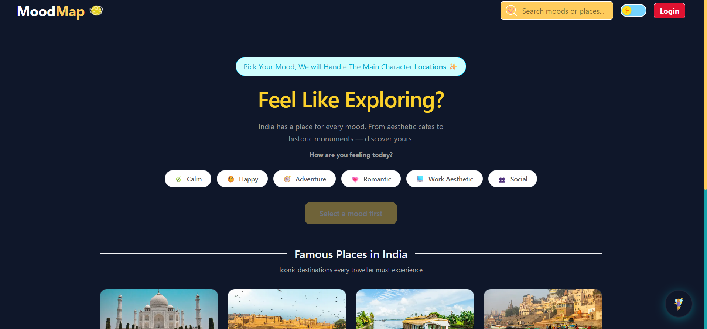
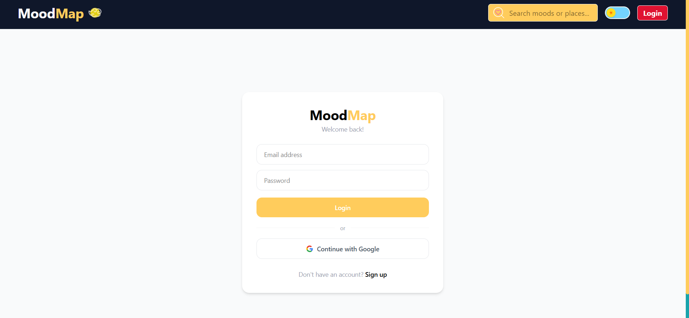

# MoodMap

> **Travel by mood, not by plans.**

MoodMap is an AI-powered mood-based travel discovery app for India. Pick how you're feeling — calm, adventurous, romantic, spiritual — and discover destinations that match your vibe. Or just tell the AI assistant how you feel in your own words, and let it suggest the perfect place for you.
Built with Next.js 15, MongoDB, NextAuth, and Google Gemini AI.


---

## 🌐 Live Demo

🔗 **[mood-map-beige.vercel.app](https://mood-map-beige.vercel.app)**

---

## ✨ Features

- 🤖 **AI Travel Assistant** — Describe your mood in natural language, and Gemini AI suggests the perfect Indian destination with emotional reasoning
- 🎭 **Mood-based filtering** — Select your mood and instantly filter matching destinations across India
- 🔐 **Authentication** — Email/password signup + Google OAuth via NextAuth.js
- 🔒 **Protected routes** — Mood filtering unlocked only for logged-in users
- 🔍 **Search** — Search places by name, city, or state via URL params
- 📖 **Detail pages** — Full place detail pages powered by the **Wikipedia API** (free, no key needed)
- 📱 **Responsive design** — Mobile-friendly navbar with collapsible search
- 🌙 **Dark/Light theme** — Smooth theme toggling with localStorage persistence
- 🔔 **Toast notifications** — Login, logout, and error feedback via react-hot-toast
- 🗂️ **25+ destinations** — Covering all moods and regions across India

---

## 🛠️ Tech Stack

| Category       | Technology                           |
| -------------- | ------------------------------------ |
| Framework      | Next.js 15 (App Router)              |
| Styling        | Tailwind CSS v4                      |
| Authentication | NextAuth.js v4                       |
| Database       | MongoDB Atlas + Mongoose             |
| AI Integration | Google Gemini API (gemini-2.5-flash) |
| External API   | Wikipedia REST API                   |
| Notifications  | react-hot-toast                      |
| Deployment     | Vercel                               |

---

## 🤖 How the AI Feature Works

The AI Travel Assistant uses **prompt engineering** with Google Gemini API to analyze a user's natural language mood input and return a structured JSON recommendation — matched strictly against the app's existing destination list.

```
User types: "very tired , want to go to a peacful place "
     ↓
Next.js Server Action calls Gemini API with engineered prompt
     ↓
Gemini returns: { destination, reason, mood_tag, best_for }
     ↓
Suggestion card renders in the floating chat UI
```

The prompt is designed to always return one of the app's existing destinations — preventing hallucinated suggestions.

---

## 📸 Screenshots

## 
## 
## 
## 


## 🚀 Installation & Setup

### 1. Clone the repo

```bash
git clone https://github.com/anuradhasharma1/mood-map.git
cd mood-map
```

### 2. Install dependencies

```bash
npm install
```

### 3. Set up environment variables

Create a `.env.local` file in the root:

```env
MONGODB_URI=your_mongodb_connection_string
NEXTAUTH_SECRET=your_nextauth_secret
NEXTAUTH_URL=http://localhost:3000
GOOGLE_CLIENT_ID=your_google_client_id
GOOGLE_CLIENT_SECRET=your_google_client_secret
GEMINI_API_KEY=your_gemini_api_key
```
> Get your free Gemini API key at [aistudio.google.com](https://aistudio.google.com)

### 4. Run the development server

```bash
npm run dev
```

Open [http://localhost:3000](http://localhost:3000) in your browser.

---

## 📁 Project Structure

```
mood-map/
├── app/
│   ├── actions/
│   │   └── getMoodSuggestion.js         # Gemini AI server action
│   ├── api/
│   │   └── auth/
│   │       ├── [...nextauth]/route.js   # NextAuth config
│   │       └── register/route.js        # User registration
│   ├── login/page.js                    # Login & Register page
│   ├── places/[id]/page.js             # Dynamic place detail page
│   ├── layout.js                        # Root layout
│   └── page.js                          # Homepage
├── components/
│   ├── AiMoodInput.js                 # AI floating chat assistant
│   ├── AuthProvider.js                  # Session provider wrapper
│   ├── HeroSection.js                   # Hero with mood-reactive colors
│   ├── MoodSelector.js                  # Mood pill buttons
│   ├── Navbar.js                        # Responsive navbar
│   ├── PlaceCard.js                     # Place card component
│   └── PlaceGrid.js                     # Places grid with filtering
├── data/
│   ├── moods.js                         # Mood definitions + vibes
│   └── places.js                        # 25+ Indian destinations
└── lib/
    └── mongodb.js                       # MongoDB connection utility
```

---

## 🔮 Future Plans
 
- [ ] Highlight AI-suggested destination in the grid automatically
- [ ] Google Maps / Leaflet.js integration for location pins
- [ ] Save favourite places (wishlist feature)
- [ ] User profile page
- [ ] Weather integration for each destination
- [ ] TypeScript migration
- [ ] More Indian destinations (50+)
 
---

## 👩‍💻 Author

**Anuradha Sharma**

- GitHub: [@anuradhasharma1](https://github.com/anuradhasharma1)

## 👨‍💻 Connect with me

[LinkedIn](https://www.linkedin.com/in/anuradha-sharmaa1/)

---

## 📄 License

This project is open source and available under the [MIT License](LICENSE).

---

> Built with ❤️ for India 🇮🇳
